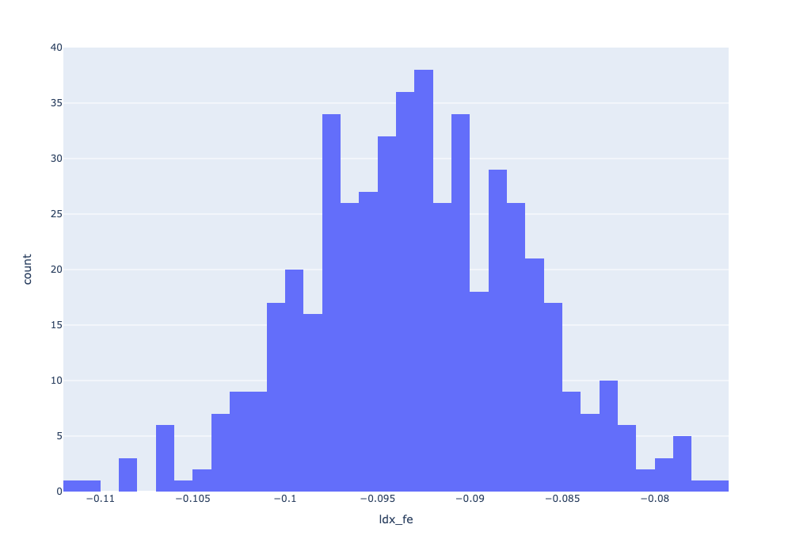
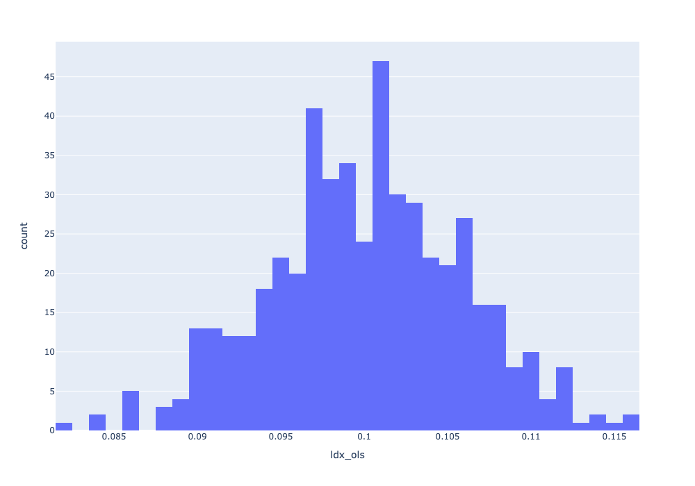
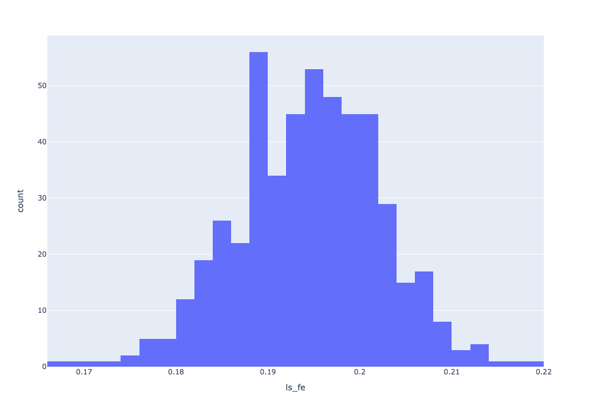
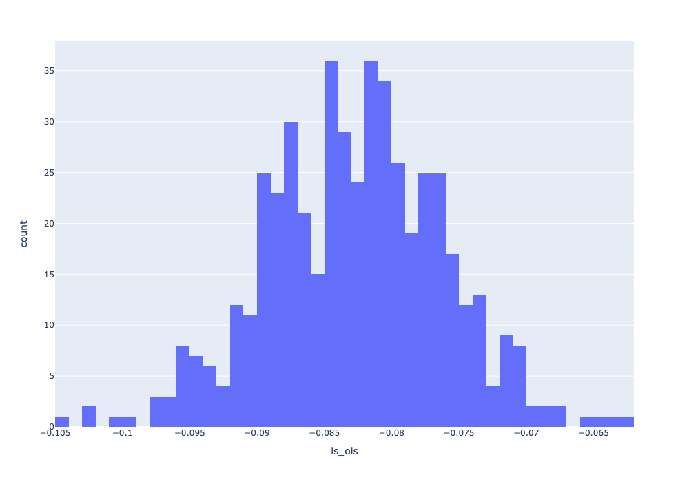
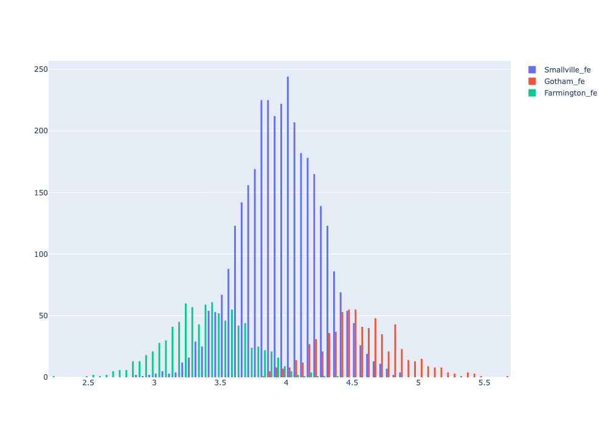
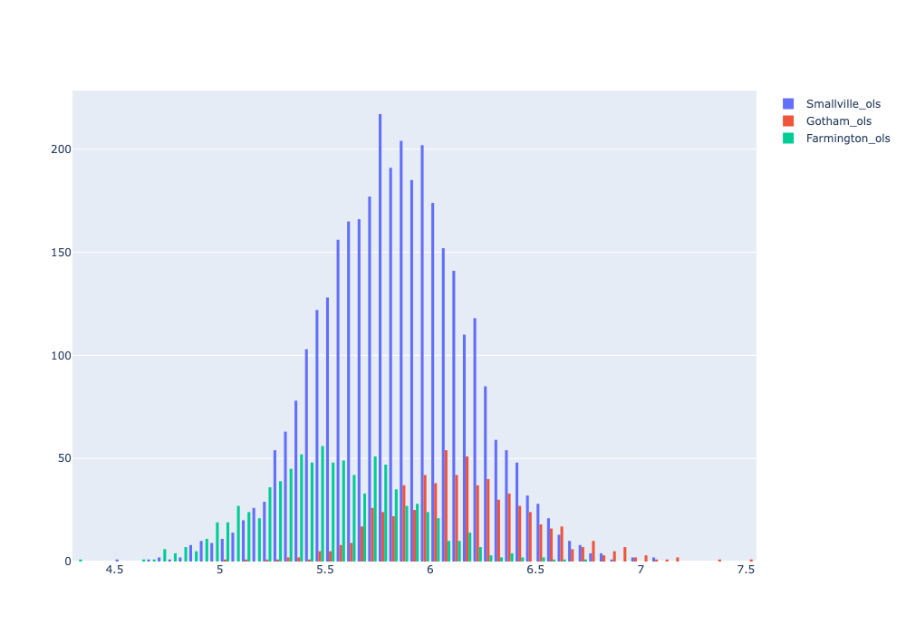

# Observations 

## Parameter estimate distributions

### Distance - fixed effects vs restricted

The OLS estimates for distance have a different central value compared to the fixed effects estimates, indicating that the inclusion of fixed effects shifts the parameter estimates significantly. 

Specifically, the OLS distribution is centered around 0.1, whilst the distribution for fixed effects regressor is centered around -0.095. This indicates that the fixed effects model has correctly surfaced a negative relationship between transaction value and distance from the city center after removing within-city effects. 

### Size - fixed effects vs restricted

The estimates distribution with fixed effects is centered around 0.19, whilst the distribution for OLS is centered around -0.085. 

Similar to distance, the inclusion of fixed effects shifts the central value of the size parameter estimates. The fixed effects model also has a different central tendency compared to the OLS model.

## In-sample residual distributions

### Residuals - fixed effects vs restricted (by city)

For the fixed effects model, each city's residuals distribution has different central tendencies and spreads.

The inclusion of fixed effects seems to result in tighter and more distinct residual distributions by city compared to the OLS model, which has more overlap and broader distributions. 

This suggests that fixed effects account better for within-group variance, leading to more accurate model fit for each city.

## Summary

The fixed effects model significantly alters the central values of the parameter estimates compared to the OLS model, indicating that accounting for group-level effects changes the estimated relationships between the covariates and the outcome.

Moreover, the fixed effects model produces more distinct and narrower residual distributions for each city, indicating a better model fit and accounting for group-level differences.
